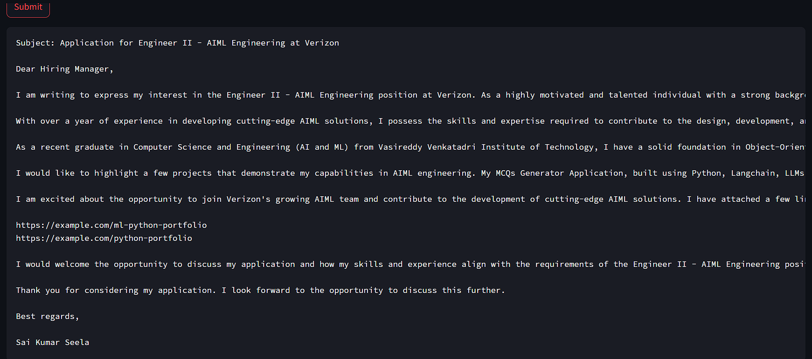

# 📧 Cold Mail Generator
Developed a cold email generator application using Llama 3.1 and the Groq API. The application allows users to input a job post link and their resume in PDF format. It extracts relevant skills, roles, and experiences from the job description, retrieves project links from a Chroma vector database, and generates a personalized cold email for HR. This tool streamlines the job application process by creating tailored outreach messages.




## Architecture Diagram


## Set-up
1. To get started we first need to get an API_KEY from here: https://console.groq.com/keys. Inside `app/.env` update the value of `GROQ_API_KEY` with the API_KEY you created. 


2. To get started, first install the dependencies using:
    ```commandline
     pip install -r requirements.txt
    ```
   
3. Run the streamlit app:
   ```commandline
   streamlit run app/main.py
   ```
   
